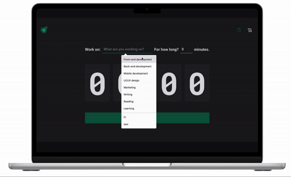

<div align="center" justify="center">


 &nbsp;&nbsp;&nbsp;


<div align="center" justify="center">
    <h1> Pomodoro Timer </h1>
  
</div>
<br />
<p align="center">
  <a href="#-technologies"> Technologies </a>&nbsp;&nbsp;&nbsp;|&nbsp;&nbsp;&nbsp;
  <a href="#-project"> Project </a>&nbsp;&nbsp;&nbsp;|&nbsp;&nbsp;&nbsp;
  <a href="#-layout">Layout</a>&nbsp;&nbsp;&nbsp;|&nbsp;&nbsp;&nbsp;
  <a href="#-challenge">How to run</a>&nbsp;&nbsp;&nbsp;|&nbsp;&nbsp;&nbsp;
</p>

<div align="center" justify="center">
 
  
  
  <a href="http://www.linkedin.com/in/thayscasado" target="_blank">
  
    </a>
    <a href="https://gofund.me/3265ea9e" target="_blank">
  
  </a>


</div>

<br>


<div align="center" justify="center">
  
</div>

<div align="left" justify="left">


## 🚀 Technologies

This project was developed using the following technologies:

- [React](https://reactjs.org)
- [TypeScript](https://www.typescriptlang.org/)
- [Vite](https://vitejs.dev/)
- [Phosphor react](https://phosphoricons.com/react/)
- [Styled components](https://styled-components.com/)
- [React hook form](https://react-hook-form.com/)
- [Zod](https://github.com/colinhacks/zod)
- [Immer](https://immerjs.github.io/immer/docs/introduction)
- [React router dom](https://reactrouter.com/web/guides/quick-start)


## 💻 Project

This project is a simple task manager, where you can set the task and the time to complete. It is a simple project to practice the use of context api, immer, react hook form, zod, styled components, react router dom, phosphor react and vite.
The user can set the task and the time to complete, and the app will start a countdown. When the countdown is over, the app will notify the user that the time is over. The user can also interrupt the countdown, and all the tasks will be saved in the local storage. we have two routes, one for the task creation and another for the task list. On the task creation the user can set the task and the time to complete, and a countdown timer and a button will be displayed. On the task list, it is a history of all the tasks created, with its respective times and status (completed, interrupted or in progress).

This project was developed during the on the [Ignite](https://rocketseat.com.br/ignite) trail, provided by [Rocketseat](https://rocketseat.com.br/) 

## 🔖 Layout

You can view the project layout through the links below:

- [Layout Web](https://pomodoro-app-rho-one.vercel.app/)


## 🚀 How to run

- Clone the repository
```bash
$ git clone git@github.com:tatacsd/pomodoro-app.git
```
- Enter the folder
```bash
$ cd pomodoro-app
```
- Install the dependencies
```bash
$ npm i
```
- Run the application
```bash
$ npm run dev
```
- The application will open on the port:5173 - access http://localhost:5173

</div>

